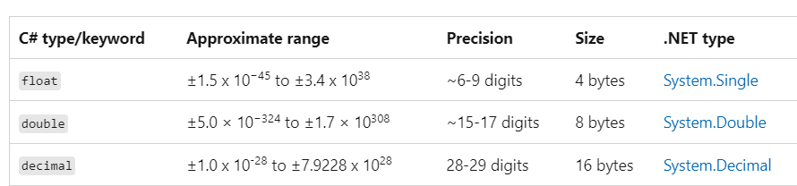

# Estructuras de Control y Datos en CSharp


> Extraje este resumen del curso en Udemy: [Curso profesional en C#: Aprende de cero a avanzado](https://www.udemy.com/course/aprende-c-sharp-y-crea-aplicaciones-multiplataforma/?srsltid=AfmBOool6ljXgRM_gIsL08-kGaFch1bagIG-WmBKbouCE3R-9qIAuZmM)

> Recomiendo este curso para aprender los fundamentos desde 0. Sin embargo, las secciones de Windows forms únicamente las recomiendo si de antemano se sabe que se va a trabajar con esa tecnología, pues es una tecnología en desuso y se está reemplazando por desarrollos que usan C#  como Backend acompañado de Frontend en Angular o React.

# Tipos de variables - Data types

- String: Cadena de caracteres. Información alfanumérica.
- Int: Valores numéricos enteros con singo, en el rango de -2147483648 a 2147483647(System.Int32)
- Long: Valores numéricos enteros realmente grandes con un rango de -9223372036854775808 a 9223372036854775807. (System.Int64)
- Short: Valores numéricos enteros, pero su rango es menor y va de -32768 a 32767.(System.Int16)
- Byte: Puede guardar un byte de información. Esto equivale a un valor entero positivo entre 0 y 255.(System.Byte)



- Bool: Variable booleana, solo puede guardar true o false.

```csharp
// Ejemplos:
string nombre = "ana";
int num1 = 27;
float estatura = 1.66f;
decimal numero = 3.25m;
double numero2 = 4.5d;
bool test = true;
byte num2 = 20;

```

## Cadenas (String)

- Clase String.
    - En su interior la cadena se guarda como una colección y cada carácter es un elemento.

### Convertir a string: con el método ToString()

- Éste es usado para convertir el tipo de dato o su representación a una cadena que puede ser formateada.

```csharp
// declarar la cadena
//Podemos declarar la variable y asignarle una cadena vacía.

String miCadena = “Hola a todos”;

String dato = “”;

// Concatenar cadenas
String nombre = “Juan”;
String apellido = “Lopez”;
String NombreCompleto = “”;
NombreCompleto = nombre + “ “ + apellido;

```

### Convertir y formatear fecha a cadenas.

- Para utilizar la fecha y la hora tenemos la clase DateTime. Si deseamos tener un objeto de este tipo y que tenga la hora actual de la máquina en el momento en que se instanció podemos hacerlo de la siguiente manera:
    
    ***DateTime miTiempo = DateTime.Now;***
    


### Darles formato a valores numéricos:


### **Comparación de cadenas: método Compare()**

- Este método es estático, por lo que podemos hacer uso de éste sin necesidad de declarar un objeto de tipo String.
- Necesita de dos parámetros, que son las cadenas a comparar

El método regresará un valor entero


### Encontrar una subcadena:

- Método Contains().
- El método Contains() sólo necesita un parámetro. Este parámetro es la subcadena a buscar. Ésta puede ser dada explícitamente o por medio de una variable de tipo String que la contenga.
- El método regresa un bool. Si la subcadena se encontró, el valor regresado es true y si no se encontró el valor regresado es false.

```csharp
// Buscar subcadenas
String NombreCompleto = “Juan Pedro Lopez”; 
String NombreBuscar = “Pedro”;

if (NombreCompleto.Contains(NombreBuscar) == true)
{
	Console.WriteLine(“El nombre se encuentra”);
} 
```

### Obtener una subcadena:

- Usando el método Substring().
- Necesita dos parámetros, que son valores de tipo entero. El primero indica el índice adentro de la cadena original donde inicia la subcadena que nos interesa obtener y el segundo es la cantidad de caracteres que tiene la subcadena.
- El método regresa una cadena que contiene a la subcadena que hemos obtenido

```csharp
// Obtener una subcadena
String cadena=”Hola mundo ”;
String resultado=””;
resultado=cadena.Substring(5,5);
```

### Determinar si una cadena finaliza en una subcadena**:**

- Usamos el método EndsWith()
- Necesita un parámetro, que será la subcadena.
- La función regresa un valor de tipo bool.

```csharp
String cadena1 = “Juan Pedro Lopez”;

String cadena2 = “Lopez”;

if(cadena1.EndsWith(cadena2) == true)
{
	Console.WriteLine(“La cadena finaliza en Lopez”);
}
```

### Copiar una parte de la cadena:

- Usamos el método CopyTo()
- Necesita cuatro parámetros:
    - El primer parámetro es el índice dentro de la cadena  principal desde donde se empezará a copiar.
    - El segundo parámetro es la cadena de tipo char donde se colocará la cadena a extraer.
    - El tercer parámetro es el índice del arreglo a partir de donde se empezarán a colocar los caracteres de la cadena copiada.
    - El cuarto parámetro indica la cantidad de caracteres a copiar
- El método no regresa ningún valor

```csharp
char[] destino = new char[10];

String cadena = “Hola a todos”;

cadena.CopyTo(7, destino, 0, 5);
```

### Insertar una cadena:

- Usamos el método Insert().
- Este también necesitará dos parámetros. El primero indicará el índice dentro de la cadena principal donde se va a insertar la nueva cadena. El segundo parámetro es la cadena que deseamos insertar, que puede ser colocada explícitamente o mediante una variable de tipo String.
- El método Insert() regresa un valor de tipo String.

```csharp
String cadena1 = “Hola a todos”;
String cadena2 = “hola ”;
String resultado = “”;
resultado = cadena1.Insert(5, cadena2);
```

### Encontrar la posición de una subcadena:

- Usando el método LastIndexOf().
- Si la cadena principal tiene dos repeticiones de esa cadena,nos da el índice de la segunda repetición.
- Necesita un parámetro y es la subcadena a encontrar
- El método regresa un valor de tipo entero que contiene el índice de la última ocurrencia de la subcadena

```csharp
int índice = 0;
String cadena = “Hola a todos. Hola”;
índice=cadena.LastIndexOf(“Hola”);
```

### Justificación del texto:

- Métodos PadLeft() y PadRight().
- Requiere de un parámetro que es la cantidad de caracteres de la cadena final. Éste es un valor entero y representa los caracteres originales más los espacios en blanco
- Regresa la cadena final justificada

***Cadena original                    Cadena resultante***

***'H' 'o' 'l' 'a’                              '' '' '' '' '' '' 'H' 'o' 'l' 'a'***

### Eliminar caracteres de la cadena

- Método Remove()
- Necesita dos parámetros, ambos de valores enteros. El primer parámetro se usa para indicar el índice a partir del cual se empezarán a eliminar los caracteres de la cadena, y en el segundo parámetro colocamos la cantidad de caracteres a eliminar.
- El método regresa la cadena resultante de la eliminación

```csharp
String cadena=”Hola mundo, hola a todos”;
String resultado=””;
resultado=cadena.Remove(12,4);
```

### **Reemplazar una subcadena**

- Usamos el método Replace()
- Además de para reemplazar subcadenas este método se puede usar para reemplazar caracteres.
- Necesita dos parámetros. El primero es la cadena que simboliza la palabra que deseamos reemplazar. El segundo es la cadena con la que la reemplazaremos
- El método regresa una cadena, que es la resultante con los reemplazos ya llevados a cabo.

```csharp
String cadena1=”Hola a todos. Hola mundo”;
String cadena2=”Adios”;
String resultado=””;
resultado=cadena1.Replace(“Hola”,cadena2);
```

### **Intercambiar mayúsculas y minúsculas**

- Método ToLower().
- Método ToUpper()
- Estos métodos no necesitan ningún parámetro.
- Los métodos regresan un valor, el valor que se devuelve será la cadena convertida totalmente a letras minúsculas o mayúsculas

```csharp
// Mayus a minus
String cadena=”Hola Hola”;
String resultado=””;
resultado=cadena.ToLower();
// Minus a mayus
String cadena=”Hola Hola”;
String resultado=””;
resultado=cadena.ToUpper();
```

### **Podar la cadena:**

Cuando una cadena tiene exceso de espacios hacemos uso del método Trim()

- No necesita ningún parámetro.
- Regresa una cadena nueva, que es la cadena original sin los espacios extras
- Es importante tener en cuenta que la cadena original no se modifica, por esta razón se recibe una cadena completamente nueva.
- También se pueden usar TrimStart() para eliminar los espacios al inicio de la cadena. Y TrimEnd() para eliminar los espacios al final

```csharp
String cadena=” Hola a todos. “;
String resultado=””;
resultado=cadena.Trim();
```

# Datos de entrada

```csharp
int edad;
Console.WriteLine("Ingresa la edad");
edad = Convert.ToInt32(Console.ReadLine());
```

# Operadores

```csharp
== Igualdad
!= No igual - Diferente
> Mayor que
< Menor que
>= Mayor o igual que
<= Menor o igual que
```

# Expresiones lógicas

```csharp
&& // y lógico
|| // o lógico
! // negación lógica
```

# Estructuras selectivas

## Estructuras Condicionales

Estructuras que permiten controlar el flujo del programa basado en condiciones.

```csharp
// if
if (condición) {
    // código
} else {
    // código
}

// switch
switch (opcion) {
    case 1:
        resultado = a + b;
        break;
    case 2:
        resultado = a - b;
        break;
    case 3:
        resultado = a * b;
        break;
    case 4:
        if (b != 0) {
            resultado = a / b;
            break;
        } else {
            Console.WriteLine("Divisor no valido");
        }
        break;
    default:
        Console.WriteLine("Opción no válida");
        break;
}
```

El switch es una alternativa al if cuando se necesitan comparar múltiples valores.

# Try Catch

Cuando se presenta un error, la aplicación se detiene. Esta estructura permite mostrar un mensaje de error cuando eso sucede.

```csharp
using System;
namespace TryCatch
{
    internal class Program
    {
        static void Main(string[] args)
        {
            int n1, n2, resultado;

            try
            {
                Console.WriteLine("Ingrese el primer número");
                n1 = Convert.ToInt32(Console.ReadLine());

                Console.WriteLine("Ingrese el segundo número");
                n2 = Convert.ToInt32(Console.ReadLine());

                resultado = n1 * n2;
                Console.WriteLine("El resultado es: {0}", resultado);

                Console.ReadKey();

            }
            catch (Exception ex)
            {
                Console.WriteLine(ex.Message);
            }
        }
    }
}

```

# Estructuras de Bucles

Permiten ejecutar un bloque de código repetidamente mientras se cumpla una condición.

```csharp
// for
for (i = 0; i < n; i++) {
    // código
}

// while
while (condición) {
    // código
}

// foreach
foreach (var item in col) {
    // código
}

do {
//código
}
while(condición)
```

El foreach es especialmente útil para recorrer colecciones de elementos.

# Clases

## Métodos

- En C# no existen funciones como tal, solo métodos
- Un método es un elemento del programa que:
    - Contiene código ejecutable
    - Se puede llamar o invocar cuando sea necesario
    - Una vez ejecutado, el programa continúa en la línea siguiente a la llamada
    - No se puede declarar dentro de otro método
- Se distinguen los siguientes tipos de métodos:
    - Solo ejecutan código
    - Reciben parámetros
    - Regresan valores
    - Reciben  parámetros  y regresan valores

```csharp
// Ejemplos de métodos

static void Suma()
        {
            // Método que solo ejecuta código
            // a, b y r son variables locales del método Suma
            float a, b;
            float r = 0;

            Console.WriteLine("Ingrese el primer número");
            a = Convert.ToSingle(Console.ReadLine());

            Console.WriteLine("Ingrese el segundo número");
            b = Convert.ToSingle(Console.ReadLine());

            r = a + b;

            Console.WriteLine("El resultado es: {0}", r);

        }
        
static void imprime(ArrayList arreglo)
// recibe parámetro
{
    foreach (string n in arreglo)
    {
        Console.Write($"{n}");
    }
}

static float Resta()
        {   // Método que regresa valores
            // a, b y r son variables locales del método Suma
            float a, b;
            float r = 0;

            Console.WriteLine("Ingrese el primer número");
            a = Convert.ToSingle(Console.ReadLine());

            Console.WriteLine("Ingrese el segundo número");
            b = Convert.ToSingle(Console.ReadLine());

            r = a - b;

            return r;

        }

static int SumaArray(int[] arr)
        {
        // recibe parámetro y regresa valor
            int suma = 0;
            foreach (int num in arr)
            {
                suma += num;
            }
            return suma;
        }
        
 

static bool BuscarElemento(ArrayList arr, string elemento)
{
// recibe parámetro y regresa valor
    foreach (string item in arr)
    {
        if (item == elemento)
        {
            return true;
        }
    }
    return false;
}

```

# Arrays

Un array es un indicador que puede almacenar varios valores simultáneamente. Cada valor se identifica mediante un índice que comienza en 0.

> Instanciación: Proceso de leer o especificar información, como los valores y el tipo de almacenamiento de un campo de datos.
> 

```csharp
// Una dimensión
int[] array = new int[5];
float[] valores = {1.5f, 3.78f,2.1f}
// Ejemplo asignación valores: 
calificaciones[2] = 8.5f

// Dos dimensiones (matrices, filas y columnas)
int[,] matriz = new int[3,3];

// Jagged (array de arrays) Ahorra memoria, podemos dejar una de las dimensiones libre
int[][] jagged = new int[3][]; // arreglo o array contenedor
jagged[0] = new int[4]; // arreglo dentro del array contenedor
```

Array enviado como parámetro a un método:

- El arreglo enviado y el arreglo del parámetro deben ser el mismo tipo de dato
- Deben tener las mismas dimensiones, es decir, ambos son como lista o como matriz
- Ambos deben ser del mismo estilo: normal o jagged

```csharp
static void Imprime(int[] arreglo)
{
código
}
// invocación
int[numeros] ) = new int[5]
Imprime(numeros); // pasamos un arreglo completo, no solo un elemento
```

# Colecciones

Estructuras de datos que permiten guardar cualquier tipo de información.

## ArrayList

Lista dinámica que puede cambiar su tamaño según necesidades.

- Propiedades:
    - Capacidad: Indica el tamaño que ocupa la lista
    - Conteo: Indica cuántos elementos está guardando en su interior
- Debemos usar el Namespace System.Collections

```csharp
ArrayList lista = new ArrayList();
datos.Add(7);
datos.Add("hello");
datos.Add(n);
//podemos acceder por medio del índice a los elementos
datos[2];
// podemos conocer el tamaño (cantidad de elementos) tal que:
elementos = datos.Count;
// con el método Insert() podemos insertar un elemento en la posición que nosotros queramos:
datos.Insert(2,5); // en la posición 2 agrega el valor 5
// eliminar elemento
datos.RemoveAt(7); // elimina el elemento que se encuentra en la posición 7
// buscar un elemento
indice = datos.IndexOf(7);  // busca el índice donde se encuentra el elemento 7, si el valor no se encuentra devuelve un -1
```

## Stack (LIFO)

Estructura tipo Last-In-First-Out. El último en entrar es el primero en salir.


Para colocar nuevos elementos en la parte superior del stack usamos el método Push.

Para quitar un elemento de la parte superior del Stack usamos el método Pop.

```csharp
Stack miPila = new Stack();
// Introducir info: 
miPila.Push(7);
miPila.Push(11);
miPila.Push(8);
// Primero se introduce el 7 , luego el 8 y después el 11
// obtener cantidad de elementos del stack:
cantidad = miPila.Count;
// eliminar elementos:
MiPila.Clear(); // Borra TODOS los elementos del Stack
// si el stack tiene un elemento. comprobar --> 
bool enStack = false;
enStack = miPila.Contains(7);
```

## Queue (FIFO)

Permite guardar elementos y cambia su tamaño de forma dinámica.

Estructura First-In-First-Out. El primero en entrar es el primero en salir.

Cuando insertamos elementos en el objeto, estos se colocan detrás del último elemento insertado. Cuando se leen los elementos se empieza por el que se encuentra en la parte superior del objeto.

```csharp
Queue cola = new Queue();
// Adición de elementos
cola.Enqueue(7);
// Extracción de elementos 
int valor = 0;
valor = cola.Dequeue();
// Observar un elemento
int valor = 0;
valor = cola.Peek();
// Saber si el queue contiene un elemento
if(cola.Contains(7) == true)
{
	Console.WriteLine("El elemento si existe")
}
// Borrar el contenido del queue
cola.Clear()

// Conocer la cantidad de elementos de queue
int cantidad = 0;
cantidad = cola.Count;
```

El proceso por medio del cual se inserta un nuevo elemento al Queue se conoce como Enqueue y el elemento se inserta al final. Enqueue pertenece a la clase Queue de C#. Este método no regresa ningún valor.

Cuando se extrae un elemento se llama Dequeue y siempre toma el elemento que se encuentra en la parte superior. No necesita parámetros. Es importante tener una variable que reciba al elemento o una expresión que haga uso de él. Al extraer el elemento lo elimina de la colección.

El método Peek()  permite observar un elemento sin eliminarlo. No necesita de ningún parámetro y regresa el elemento observado. Al igual que con Dequeue debe existir una variable o expresión que reciba este valor.

El método Contains regresa un valor de tipo booleano y permite testar si un elemento se encuentra en la queue o no.  Necesita de una variable o de una expresión que reciba su valor. 

Para borrar el contenido del objeto usamos el método Clear. No  necesita de ningún parámetro.

Con el método Count() podemos conocer la cantidad de elementos. 

## Hashtable

Es una colección indexada. Vamos a tener un índice y un valor referenciado a ese índice. 

Sin embargo, la indexación no se lleva a cabo como en el array o en el ArrayList. La posición en la que se almacena el elemento dentro del Hashtable va a depender de un valor conocido como key o llave.

El valor que almacena key, se usa para calcular la posición del elemento en el hashtable. El elemento que vamos a colocar se conoce como value.

```csharp
Hashtable miTabla = new Hashtable();
// Adición de elementos
miTabla.Add("Pan", 5.77);
// Recorrer Hashtable
foreach(DictionaryEntry datos in miTabla){
	Console.WriteLine("Key -{0}, Value-{1}", datos.Key, datos.Value)
}
// Obtener un elemento del HashTable:
object valor = miTabla[2]
// Borrar el contenido del HashTable:
miTabla.clear();
// Encontrar un elemento
// - usando la  key
bool existe;
existe = miTabla.Contains("Pan"); // tb se puede usar el método ContainsKey();
// - usando el value
bool existe;
existe = miTabla.ContainsValue(17.50);
// Eliminar un elemento del HashTable
miTabla.Remove("Pan");

```

Para insertar un elemento usamos el método Add y habrá que indicar key y value.

Para recorrer un Hashtable vamos a hacer uso del foreach. Si queremos obtener la pareja key-value, nos apoyaremos en una clase conocida como DictionaryEntry. El diccionario también guarda parejas de datos. 

Siempre que se referencia la HashTable utilizando una key, será retornado el valor correspondiente a dicha clave en un objeto de tipo Object, por lo que es importante convertir el dato obtenido al tipo de dato adecuado.

Al eliminar elementos, eliminamos la pareja key-value. No se puede eliminar una key sin eliminar el value y viceversa. El método Remove solo necesita de un parámetro, la key. El primer elemento en salir es el último en entrar (LIFO). Pero importante los nuevos elementos se añaden al final, a diferencia del stack que se añaden al principio.

El método Count no existe en el Hashtable.

# Estructuras

- Las estructuras son tipos definidos por el programador y son un conjunto de datos agrupados que se conocen como campos.
- Cada campo está representado por una variable.
- Una vez creada la estructura, se pueden crear variables en base a esa estructura.

Podemos tomar como ejemplo una agenda telefónica ya que esta requiere almacenar mucha información en diferentes campos, requeriría más trabajo hacerlo mediante arreglos. Es por esto que usamos una estructura para organizar mejor la información y poder administrarla mejor.


## **Definir una estructura:**

Para definir una estructura debemos usar tres pasos:

**1. El acceso**: indica si la estructura puede verse fuera del ámbito donde ha sido definida o no. Si el acceso es de tipo público, se puede acceder a la estructura fuera del ámbito. Para esto pondremos como acceso ***public***. Si no deseamos que el exterior pueda acceder a la estructura, entonces la colocamos como privada. Para esto colocamos el acceso como ***private***

2. Para **definir** una estructura: Para indicar que definimos una estructura usamos ***struct*** seguido del nombre de la estructura. Éste puede ser cualquier nombre válido en C#. No hay que confundir el nombre de la estructura con la o las variables.

3. Crear bloque de **código:** Dentro de este bloque definiremos los campos que necesitamos. Éstos se definen igual que las variables, pero es necesario colocar el acceso

```csharp
public struct Agenda
{
	public String Nombre;
	public int Edad;
	public String Telefono;
}
```

## **Crear una variable del nuevo tipo:**

- Para definir la variable sólo deberemos poner el nombre del tipo seguido del nombre que le daremos a nuestra variable
- Podemos crear un arreglo de la estructura. Este arreglo puede ser del tamaño que necesitemos para nuestra aplicación

```csharp
Agenda amigo; // definir la variable
Agenda []amigos=new Agenda[15];
Agenda []clientes=new Agenda[5];
```


## **Acceder a los campos de la estructura:**

```csharp
// Ejemplo formato: VariableEstructura.Campo
amigo.Edad = 25; // formato con caso real
```

 

## **Mostrar los campos de la estructura:**

- La forma de mostrar todos los datos contenidos en los campos es mediante la conversión de la estructura a una cadena.
- Usamos el método llamado ToString(). Se debe programar.

### Estructuras enlazadas

Las estructuras nos dan la facilidad de poder agrupar información que está relacionada adentro de un mismo elemento.

Tenemos una estructura que se llama **Agenda**, pero esta agenda está incompleta, debido a que nos hace falta colocar la dirección o el domicilio de la persona.

Podríamos colocar dos campos nuevos como la calle y el número de la casa, pero 
para poder entender muy bien el tema de las estructuras debemos crear 
otra estructura llamada **Direccion** que contenga esta estos campos.

Por ejemplo, la estructura quedaría de la siguiente forma:

```csharp
public struct Direccion
{
    public String Calle;
    public int Numero;
                                 
    //Constructor Direccion
    public Direccion(String pCalle, int pNumero)
    {
        Calle = pCalle;
        Numero = pNumero;
    }
}
```


Como vemos, los campos son Calle y Numero. Se ha creado un constructor para 
ayudarnos a colocar la información fácilmente cuando se ***instancie*** una variable de este nuevo tipo. Ahora que ya está definido el nuevo tipo **Direccion**, podemos usarlo en la estructura **Agenda.**


💡Diferencia entre estructura y clase: https://www.campusmvp.es/recursos/post/clases-y-estructuras-en-net-cuando-usar-cual.aspx

Hay dos clases de tipos en C#. Las estructuras son de tipo valor y las clases de tipo referencia. 

Cuando se dice que las estructuras son de tipo valor, esto significa que  contienen directamente los datos en stack o "pila", es decir, último en entrar, primero en salir. Mientras que las clases,  de tipo referencia, almacenan referencias en la memoria.

*"Con los tipos de referencia, dos variables pueden hacer referencia al mismo 
objeto y, por lo tanto, las operaciones en una variable pueden afectar 
al objeto al que hace referencia la otra variable. Con los tipos de 
valor, cada variable tiene su propia copia de los datos, y no es posible
 que las operaciones en una variable afecten a la otra"*

Lo habitual es no usar estructuras casi nunca, salvo para realizar optimizaciones.


# Programación orientada a objetos

- **¿Que es?**: Es un paradigma de la programación. Esto quiere decir que
es una forma de resolver problemas a través de clases y objetos
- **¿Que es un objeto?**: Es una unidad dentro del programa que tiene **características** (variables o atributos) y puede realizar diferentes **acciones** (métodos).
- Que es una **clase**?: Las clases son los “planos” o “moldes” con los que fabricaremos objetos
- **Instancia: Creación de un nuevo objeto**


## **El método constructor:**

El constructor es un método que nos permitirá llevar a cabo la 
inicialización de los campos (estado inicial del objeto) y consta de 
algunas características importantes:

- Se llamará igual que la clase o estructura a la que pertenece.
- El constructor se invoca automáticamente cuando llevamos a cabo la instanciación de la variable de la estructura.
- No tiene tipo. No sólo no regresa nada, no tiene tipo.
- Debe ser ***public*** para que pueda ser llamado desde fuera

```csharp
// Ejemplo: Condición inicial del objeto

Class Silla
{

		public Silla() 
		{
	
			Patas = 4;
	
			Espaldar = 1;
	
			Cojines = 1;
	
			Altura = 1,5;
	
		}

}
```

### **Método con sobrecarga**

La sobrecarga es una técnica de programación que permite tener varias versiones de una función o un método. El compilador selecciona la versión a utilizar basándose en la cantidad de parámetros y los tipos. Esto nos permite agrupar métodos diferentes bajo un mismo nombre o concepto, facilitando la programación, solamente 
recordando un nombre, y no los nombres para cada versión.

### Método virtual

Se puede crear en un formulario base que heredan otros formularios y permite a partir de una misma configuración añadir funcionalidades específicas.

## Enumeraciones

- Tipos que nosotros podemos definir, pero tendrán un número finito de valores posibles, es decir, que podemos definir el tipo y los valores a guardar.
- Las enumeraciones son útiles cuando tenemos información que sabemos que solamente puede tener uno de una serie de posibles valores.

**Declaración y asignación de valores:**

Para declarar una enumeración usamos el siguiente formato:

```csharp
enum nombre {valor1, valor2, …, valorn};
```

## **Las clases**

El componente principal de la programación orientada a objetos es la clase. Nosotros podemos pensar en la clase como si fuera un plano por medio del cual podemos crear objetos, por ejemplo, una casa. Para hacer una casa lo primero que hacemos es pensar lo que va a incluir (cuartos, baños, cocinas, patios, etc) que deseamos que tenga y luego diseñamos un plano.

El plano no es la casa,  no podemos vivir ni actuar en él. Sin embargo, éste nos 
proporciona las características de la casa. Por medio del plano podemos construir la casa y en esta construcción sí podemos llevar a cabo nuestras actividades.

**Instanciación:** Objeto creado a partir de una clase también conocido como instancia de la clase.

**Objeto:** Es una unidad dentro del programa que tiene características y puede realizar diferentes acciones.

**Métodos o funciones:** Comportamiento de los objetos

**Datos:** son la información con la que trabajará la clase. La clase solamente 
debe tener los datos que necesita para poder llevar a cabo su trabajo

### **Cómo declarar la clase y los datos:**

La declaración de la clase es un proceso sencillo. Las clases se declaran 
dentro de un namespace y cualquiera que tenga acceso a ese namespace 
puede crear objetos de la clase. No olvidemos que la clase es como el 
plano y los objetos son realmente los que usamos para llevar a cabo el 
trabajo.

```csharp
 class nombre {
 // datos … …

// métodos …

}
```

El nombre debe ser único para el namespace, es decir no podemos tener dos 
clases que se llamen igual adentro del mismo namespace.

```csharp
class Cubo 
{
    // Declaramos los datos 
    public int lado; 
    public int area; 
    public int volumen; 
} 

class Prisma 
{ 
    // Declaramos los datos 
    public int ancho; 
    public int alto; 
    public int espesor; 
    public int area; 
    public int volumen; 
}
```

Ahora lo que necesitamos hacer es colocar los métodos de la clase:

```csharp
class Cubo 
{
    // Declaramos los datos
    public int lado;
    public int area;
    public int volumen;

    // Método para calcular el área
    public void CalculaArea()
    {
        area = (lado * lado) * 6;
    }

    // Método para calcular el volumen
    public void CalculaVolumen()
    {
        volumen = lado * lado * lado;
    }
}
```

### **Cómo crear la instancia de nuestra clase:**

Ya tenemos la clase cubo, que es el plano donde se indica qué datos tiene y qué información utilizará con ellos. Ahora tenemos que construir el 
objeto, que es quien llevará a cabo el trabajo en realidad.

Para ***instanciar*** un objeto de la clase cubo debemos utilizar el código que se muestra a continuación:

```csharp
    cubo miCubo = new cubo();
```

### **Cómo asignarles valores a datos publicos:**

Como ya tenemos la instancia, ya podemos comenzar a trabajar con ella. Lo primero que haremos será asignarle un valor al dato lado. Haremos la asignación por medio del operador de asignación **= (igual)**, pero también deberemos indicar a cuál de todos los datos de la clase vamos a acceder. Esto lo hacemos con el operador **punto**. Por ejemplo:

```csharp
miCubo.lado = 5;
// Desplegamos los datos
Console.WriteLine(“Area={0}, Volumen={1}”, miCubo.area, miCubo.volumen);
```

### **Protección de datos y creación de propiedades:**

Para proteger los datos tenemos que hacerlos privados y proveer una función 
de interfaz a aquellos a los que se necesita acceder por el exterior. 
Las propiedades son funciones de interfaz. Nos permiten acceder a los 
datos privados de una manera segura y controlada

```csharp
class Prisma 
{
    // Declaramos los datos 
    private int ancho;
    private int alto;
    private int espesor;
    private int area;
    private int volumen;
}
```

La propiedad puede ser de varios tipos: lectura, escritura y lectura-escritura.

Una propiedad de ***lectura*** solamente nos permite leer el dato, pero no podemos agregarle información.

Una propiedad que es de tipo ***escritura*** sólo nos permite colocar información en el dato, pero no podemos leerlo.

La propiedad de ***lectura-escritura*** permite llevar a cabo ambas acciones. Para poder hacerlo, la propiedad tendrá dos métodos. El método relacionado con la lectura se conoce como ***get*** y el relacionado con la escritura es ***set***. 

```csharp
public tipo nombre 
{
    get 
    {
        return x;
    }
    
    set 
    {
        x = value;
    }
}
```

Cuando usemos el método set tendremos una variable previamente definida por el lenguaje que se llama ***value.*** Esta variable representa el valor que el usuario ingresa y podemos usarlo en la lógica que necesitemos.

## Herencia y polimorfismo

### **Herencia:**

- Una clase nueva se crea a partir de una clase ya existente
- Hereda los atributos y características de una clase padre
- Es el mismo concepto para todos los lenguajes
- Se trata de programar una sola vez algo y usarlo las veces que necesitemos

### **Polimorfismo:**

- Capacidad de una clase de utilizar sus métodos de diferentes formas
    - Sobre-escritura del método: Utilizar el método con el mismo nombre pero cambiarle el comportamiento que tuvo en un principio
    - La clase hijo hereda de la clase padre pero si hay más clases, estas
    también heredaran los atributos de la clase padre pero todas las clases
    hijos no usan el método heredado de la misma manera**CÓDIGO VÍDEO HERENCIA:**


# Creación de archivos

```csharp
using System;
using System.IO;//in And Out namespace para poder trabajar con archivos
 
namespace CreacionDeArchivos
{
    class Program
    {
        static void Main(string[] args)
        {
            Console.WriteLine("Escribe el mensaje a guardar");
            TextWriter archivo1;//definimos una variable del tipo nuevo 
            archivo1 = new StreamWriter("informacion.txt");//usamos el StreamWriter para crear un  archivo .txt
            string mensaje1 = Console.ReadLine(); //creamos una variable que almacene lo que vamos a escribir   
            archivo1.WriteLine(mensaje1);//Usamos el método WriteLine que pertenece a archivo1 ya que hereda de IO
            archivo1.Close();//usamos el método Close() para que nuestra aplicación se cierre automaticamente y guarde la información 
            Console.Clear();//impiamos la pantalla con el método Clear()
            Console.WriteLine("Archivo guardado corectamente");
 
            TextReader leerArchivo; /* Declaramos una variable especial del tipo nuevo
            usando TextReader para que le indique al programa que vamos a leer la información*/
            leerArchivo = new StreamReader("informacion.txt");// usamos StreamReader para que el programa llame el archivo 
            Console.WriteLine(leerArchivo.ReadToEnd());//imprimimos la información y le pasamos el método ReadToEnd para que muestre la información completa 
            leerArchivo.Close(); 
 
            Console.WriteLine("Escribe el mensaje a guardar");
            StreamWriter archivo1 = File.AppendText("informacion.txt");/*para introducir información sin que modifique la
            ya guardada, usamos una clase File y su método AppendText para introducir información en el archivo */
            string mensaje = Console.ReadLine();
            archivo1.WriteLine(mensaje);
            archivo1.Close();
            Console.Clear();
            Console.WriteLine("Archivo guardado corectamente");
            Console.ReadKey();
 
           
 
        }
    }
}
```


# Conexiones a bases de datos


💡Instalar sql server express, instalación básica y darle a todos los checks de personalizada.


## Conectar una base de datos ya existente con visual studio

click derecho en data connections→ add connection


## Resolver error sql client

click derecho en la solución→ Manage NuGet Packages for solutions


pestaña de browse , instalar para todos los proyectos. 

En caso de instalaciones específicas: seleccionar solo los proyectos en los que aplique.

# Creando .dll: librerías

Las librerías permiten:

- Reutilizar código
- Aplicación rápida
- Conexiones remotas: un solo cambio
- Validación de campos

Click derecho solución→ add new project to the solution


Una vez creada la librería, en la solución click derecho→ add project as reference


# ASP.NET

Para crear aplicaciones web se necesita añadir desde el instalador de visual studio 2022:app web de [asp.net](http://asp.net) vista controlador

# HTML

[https://htmlcheatsheet.com/](https://htmlcheatsheet.com/)

# Entidades

Paquetes de nugget mínimos:

- EntityFrameworkCore
- EntityFrameworkCore.SqlServer
- AspNetCore.Http

En el archivo appsettings.json:

- conexión BBDD
- logging
- hosts permitidos

## Información básica entidades

[https://learn.microsoft.com/es-es/training/modules/persist-data-ef-core/2-understanding-ef-core](https://learn.microsoft.com/es-es/training/modules/persist-data-ef-core/2-understanding-ef-core)

Entity Framework Core (EF Core) es un *asignador relacional de objetos (ORM)*. Un ORM proporciona una capa entre el modelo de dominio que se implementa en el código y una base de datos. EF Core es una API de acceso a datos que permite interactuar con la base de datos mediante *objetos de Common Runtime Language (CLR) antiguos sin formato (POCO)* de .NET y sintaxis de *Language Integrated Query (LINQ)* fuertemente tipada.

En EF Core, la base de datos se abstrae detrás de los POCO de .NET. EF Core controla la interacción directa con la base de datos subyacente. Al usar esta API, puede dedicar menos tiempo a traducir solicitudes a y desde la base de datos y escribir SQL, y más tiempo a centrarse en la lógica de negocios importante.

Con EF Core, puede hacer lo siguiente:

- Cargar datos como objetos (entidades) de C#.
- Agregar, modificar y eliminar datos llamando a métodos en las entidades.
- Asignar varias tablas de base de datos a una sola entidad de C#.
- Controlar los problemas de simultaneidad que surgen cuando varios usuarios intentan actualizar simultáneamente el mismo registro.
- Use la sintaxis LINQ ([System.Linq](https://learn.microsoft.com/es-es/dotnet/api/system.linq)) para consultar la base de datos.
- Acceder a [varias bases de datos](https://learn.microsoft.com/es-es/ef/core/providers/), como SQL Server, SQLite, Azure Cosmos DB, PostgreSQL, MySQL, etc.
- Compilar el modelo de dominio a partir de una base de datos existente.
- Administrar el esquema de base de datos en función del modelo de dominio.
- Confirmar los cambios en gráficos de objetos complejos, profundos o anchos de entidades relacionadas con una sola llamada de método.

### Arquitectura EF Core


[DbContext](https://learn.microsoft.com/es-es/ef/core/dbcontext-configuration) es una clase especial que representa una unidad de trabajo. `DbContext` proporciona métodos para configurar opciones, cadenas de conexión, registros y el modelo usado para asignar el dominio a la base de datos.

Clases que derivan de `DbContext`:

- Representan una sesión activa con la base de datos.
- Guardan y consultan instancias de entidades.
- Incluyen propiedades de tipo `DbSet<T>` que representan tablas en la base de datos.

El proveedor de EF Core traduce los cambios de gráfico de objeto a código SQL.

El proveedor de base de datos:

- Es una biblioteca de complementos que se ha diseñado para un motor de base de datos específico, como SQL Server, Azure Cosmos DB o PostgreSQL.
- Traduce las llamadas de método y las consultas LINQ al dialecto SQL nativo de la base de datos.
- Amplía EF Core para habilitar una funcionalidad que es única para el motor de base de datos.